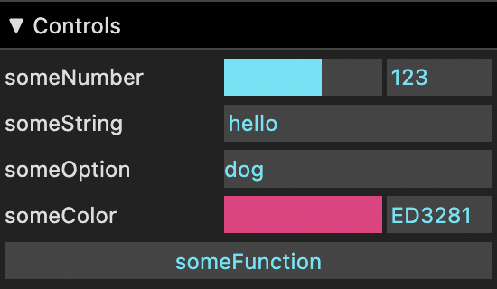

# muigui


A simple Web UI library.

muigui is a simple UI library in the spirit of
[dat.gui](https://github.com/dataarts/dat.gui) and/or [lil-gui](https://github.com/georgealways/).

## Usage

```js
import GUI from 'https://muigui.org/dist/0.x/muigui.module.js';
```

or

```html
<script src="https://muigui.org/dist/0.x/muigui.min.js"></script>
```

Then

```
const s = {
  someNumber: 123,
  someString: "hello",
  someOption: "dog",
  someColor: '#ED3281',
  someFunction: () => console.log('called')
};

const gui = new GUI();
gui.add(s, 'someNumber', 0, 200);  // range 0 to 200
gui.add(s, 'someString);
gui.add(s, 'someOption, ['cat', 'bird', 'dog']);
gui.addColor(s, 'someColor');
gui.add(s, 'someFunction');
```

produces



## What

It is not a general purpose library for every type of GUI.
Rather, it is a small, easy to use library for small apps.
Basically I liked how simple it was to use dat.gui to add
a few sliders and options to a demo.

I thought I'd try to make a CSS/DOM based UI standard elements
only and then require CSS to style it and see how far I got.

### Not invented here syndrome

It's possible this already exists but if so I couldn't find it.
Most UI libraries seem to be giant and require a build step.
I wanted something hopefully not too big and something I could
easily add to any example with 1 file (or 2 if you add CSS).

## muigui - wat?

https://user-images.githubusercontent.com/234804/177000460-3449c2dd-da94-4119-903f-cc7460b46e7b.mp4


## License

[MIT](https://github.com/greggman/muigui/blob/main/LICENSE.md)
