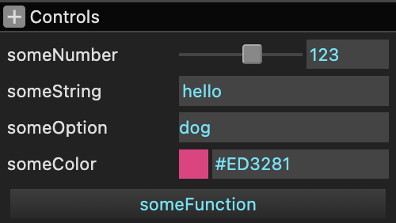

# muigui (⍺)

A simple Web UI library.

[See docs here](https://muigui.org)

muigui is a simple UI library in the spirit of
[dat.gui](https://github.com/dataarts/dat.gui) and/or [lil-gui](https://github.com/georgealways/) and [tweakpane](https://cocopon.github.io/tweakpane/)

## Usage

```js
import GUI from 'https://muigui.org/dist/0.x/muigui.module.js';
```

or

```html
<script src="https://muigui.org/dist/0.x/muigui.min.js"></script>
```

Then

```js
const s = {
  someNumber: 123,
  someString: 'hello',
  someOption: 'dog',
  someColor: '#ED3281',
  someFunction: () => console.log('called')
};

const gui = new GUI();
gui.add(s, 'someNumber', 0, 200);  // range 0 to 200
gui.add(s, 'someString');
gui.add(s, 'someOption', ['cat', 'bird', 'dog']);
gui.addColor(s, 'someColor');
gui.add(s, 'someFunction');
```

produces



## Why

So, to be honest, I like [tweakpane](https://cocopon.github.io/tweakpane/) and
I didn't know about it when I started this library. That said, I've looked
into using tweakpane and it doesn't meet my needs as of v4.0.0. Examples below

* ## Simpler
  
  I wanted certain things to be simpler. For example, in dat.gui/lil.gui/tweakpane, if I wanted
  to store radians in code but show degrees in the UI I had to jump through
  hoops. I could either, store degrees and convert 😢

  ```js
  const settings = {
    angle: 45,
  };
  gui.add(settings, 'angle', -360, 360);

  ...
     const rotation = settings.angle * Math.PI / 180
  ```

  That's bad IMO. I shouldn't have to refactor my code to fit the GUI.

  I can make some proxy class that presents degrees to the GUI
  and stores them in radians like this

  ```js
  class DegRadHelper {
    constructor( obj, prop ) {
      this.obj = obj;
      this.prop = prop;
    }
    get value() {
      return this.obj[this.prop] * 180 / Math.PI;
    }
    set value(v) {
      this.obj[this.prop] = v * Math.PI / 180;
    }
  }
  const settings = {
    angle: Math.PI * 0.5,
  };
  gui.add(new DegRadHelper(settings, 'angle'), 'value', -360, 360);
  ```

  But that looks poor to use. What is `'value'`?? 😭

  So, muigui handles that slightly nicer in the form of converters.

  ```js
  const settings = {
    angle: Math.PI * 0.5,
  };
  const degToRad = d => d * Math.PI / 180;
  const radToDeg = r => r * 180 / Math.PI;
  gui.add(s, 'angleRad', {
    min: -360, max: 360,
    converters: {
      to: radToDeg,
      from: v => [true, degToRad(v)],
    }});
  ```

  Typically I'll pull out the settings like this

  ```js
  const degToRad = d => d * Math.PI / 180;
  const radToDeg = r => r * 180 / Math.PI;
  const radToDegSettings {
    min: -360, max: 360,
    converters: {
      to: radToDeg,
      from: v => [true, degToRad(v)],
    }});
  ```

  And then I can use it like this

  ```js
  const settings = {
    angle: Math.PI * 0.5,
    rotation: Math.PI * 0.25,
  };
  gui.add(s, 'angleRad', radToDegSettings);
  gui.add(s, 'rotation', radToDegSettings);
  ```

  You provide converters where `to` converts to the form the UI wants
  and `from` converts back. The reason `from` returns a tuple is that
  it's used to convert the text and gives you a chance to say the text
  does not match the required format in which case you return `[false]`

  Other examples of simpler: Want a drop-down for numbers?

  ```js
  const settings = { speed: 1 }

  // tweakpane
  pane.addBinding(settings, speed, {
    options: {
      slow: 0,
      medium: 1,
      fast: 2,
    }
  })

  // muigui
  gui.add(settings, 'speed', ['slow', 'medium', 'fast']);
  ```

  Want a drop-down for strings

  ```js
  const settings = { alphaMode: 'opaque' }

  // tweakpane
  pane.addBindng(settings, 'alphaMode', {
    options: {
      'opaque': 'opaque',
      'premultiplied': 'premultiplied',
    }
  });

  // muigui
  gui.add(settings, 'alphaMode', ['opaque', 'premultiplied']);
  ```

  Of course you can also pass in key/value settings like tweakpane.

* ## Color formats and storage

  I often work with WebGL and WebGPU. The most common colors are in an array or a typedArray
  
  ```js
  const uniforms = {
    color1: [1, 0.5, 0.25],                   // orange
    color2: new Float32Array([0, 1, 1]);      // cyan
    color3: new Uint8Array([0, 128, 0, 128]); // transparent green
  }
  ```

  Neither dat.gui, lil.gui, nor tweakpane can edit these AFAICT. (2023)
  You'd have to jump
  through the hoops like the `DegRadHelper` example above but it's not
  that easy because, if you're showing the value textually
  then you want that value to be the one you want to show the user,
  not the value the editor wants.

  This is still an issue in muigui where it uses the browser's built
  in color editor in parts. That editor might show 0-255 values but if it's
  editing 0 to 1 values it'd be nice if the editor showed 0 to 1 values.

  muigui does handle this in the text part of it's color display. If you
  ask it to edit 0 to 1 values it shows 0 to 1 values in the text part.
  The reason you need the text part is so you can copy and paste colors

  muigui also edits hsl colors. By that I don't mean the editor can
  switch to an HSL editor, I mean the actual value that comes out
  is `hsl(hue, sat, luminance)` and not some RGB value. Like the number
  conversions, it would be easy to add `hsv`, `hsb`, maybe `labch` etc...

* ## More Use Cases

  In some projects, I'd end up writing a small
  app with an HTML form and then have to write all the code to parse
  the form and I'd be thinking "It would be so nice if I could use
  the same API as dat.gui 🙁

  So, I thought I'd try to write a library that handled that case.

I also wanted to explore various things though many of them
have not made it into muigui yet.

* ## PropertyGrid

  I'm sure the first app to do this was something from the 60s or 70s
  in Smalltalk or something but my first experience was C#. In C#
  the UI library had a `PropertyGrid` which you could pass any class
  and with would auto-magically make UI to edit the public fields
  of that class. If you've ever used Unity, it's the same. You declare
  a class and it immediately shows a UI for all of its public properties.

  That's easier in a typed language than a more loose language like
  JavaScript.

  I'm still experimenting with ideas but it sure would be nice to
  get that for JS. Just give it an object and get a UI. You can
  then customize later.

  To be more concrete. Here's some code to setup a GUI
  
  ```js
  const s = {
    someNumber: 123,
    someString: 'hello',
    someOption: 'dog',
    someColor: '#ED3281',
    someFunction: () => console.log('called')
  };

  const gui = new GUI();
  gui.add(s, 'someNumber', 0, 200);  // range 0 to 200
  gui.add(s, 'someString');
  gui.add(s, 'someOption', ['cat', 'bird', 'dog']);
  gui.addColor(s, 'someColor');
  gui.add(s, 'someFunction');
  ```

  I'd really like it to be this

  ```js
  const s = {
    someNumber: 123,
    someString: 'hello',
    someOption: 'dog',
    someColor: '#ED3281',
    someFunction: () => console.log('called')
  };

  const gui = new GUI();
  gui.add(s);
  ```

  At the moment that won't work. `someNumber` could only become
  a `TextNumber` because there's no range. `someOption` would
  only become a `Text` because there's no info that it's an enum.
  `someColor` would become a `Text` because there's no info that
  it's a color. So in the end only 2 of the 5 would work without
  having to provide more info.

  It's not clear in JS that adding that info would be a win
  for keeping it simple but it sure would be nice.

* ## Modularity

  Ideally I'd like it to be easy to make UIs based on collections
  of parts. A simple example might be a 3 component vector
  editor that is the combination of 3 number editors.

  I'm still experimenting. While muigui has components that
  do this I'm not happy with the API ergonomics yet.

  Similarly I'd like to more easily split layout so it's trivial
  to layout sub components. Again, still experimenting.

* ## Don't over specialize

  This might be ranty, but I find libraries that try to do too much,
  frustrating. In this case, it would
  be a library that graphs data for you. The problem
  with this functionality is that there is no end to
  the number of features that will be requested.

  You start with "graph an array of numbers".
  Then you'll be asked to be able to supply a range.
  Then you'll be asked to allow more than one array
  for the graph.
  You'll next be asked to let you specify a different
  color for each array. Next you'll be asked to draw
  axes, in different colors, with different units,
  and labels. Then you'll be asked to have an option
  to fill under the graph. Etc, etc, etc... forever.

  In this case, It's arguably better to provide
  a canvas and let the developer write their
  own graphing code. Maybe provide an example or
  a simple helper for the simplest case.

  They can even choose when to update vs having to
  choose an interval.

  Let's compare

  ```js
  // tweakpane
  const pane = new Pane();
  pane.addBinding(PARAMS, 'wave', {
    readonly: true,
    view: 'graph',
    min: -1,
    max: +1,
  });

  // muigui
  const gui = new GUI();
  helpers.graph(gui.addCanvas('wave'), waveData, {
    min: -1,
    max: +1,
  });
  ```

  It wasn't any harder to use, but the fact that we
  just returned a canvas and left the rest outside
  the library made it way more flexible.

  This problem of providing too specialized a solution
  is endemic throughout the library ecosystem of pretty much
  every language.

  There's a balance, but in general, if you need
  to add more and more options then it was probably the
  wrong solution. It's better to provide the
  building blocks.

## No Save/Restore

The problem with save/restore in lil.gui etc is it assumes the data
I want to edit can be serialized to JSON

Just as the simplest example I can think of

```js
const material = new THREE.MeshBasicMaterial();

const gui = new GUI();
gui.addColor(material, 'color');
```

It makes no sense to save/restore here. I'm editing a three.js material.
If I wanted to serialize anything I'd serialize the material.

Otherwise I can just save the stuff I passed to the GUI.

```js
  const s = {
    someNumber: 123,
    someString: 'hello',
    someOption: 'dog',
    someColor: '#ED3281',
  };

  // save
  const str = JSON.stringify(s);

  // restore
  Object.assign(s, JSON.parse(str));
  gui.updateDisplay(); 
```

In other words, the serialization is too specialized. It's trivial
to call `JSON.stringify` on data that serializable. No need to put
serialization in the GUI. Note: I get that you might want to save
some hidden gui state like whether or not a folder is expanded.
You still run into the issue though that the data being edited
might not be easily serializable so you'd have to find another solution.

## Future

I'm under sure how much time I'll continue to put into this.
I get the feeling other people are far more motivated to make
UIs. Maybe if I'm lucky they'll take some inspiration from
the thoughts above and I'll find they've covered it all.

## License

[MIT](https://github.com/greggman/muigui/blob/main/LICENSE.md)
